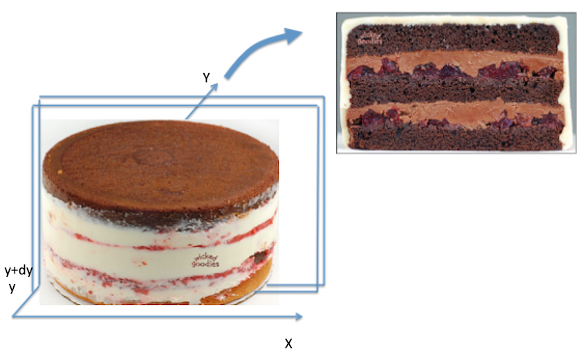

<h1>Unit 4 Live Session </h1>
<h3> W203 Instructional Team </h3>


# Distribution of Random Variables


# Class Announcements

1. Announcement 1
2. Announcement 2


# Understanding Joint Distributions

In this picture, we imagine putting a cake down on the X-Y plane.

Take a sharp knife and make two cuts parallel to the X-axis.  one is at $Y=y$, the other at $Y=y+dy$.



Remember some of the key terms we learned in the async:

- Joint Density Function
- Conditional Expectation
- Conditional Distribution
- Marginal Distribution

What would each of the following represent?

- The height of the cake before being cut.
- The shape of the slice  (what do you need to do if the total area of the slice isn't 1?)
- The total weight of the slice.
- The point on the X-axis where the slice would be perfectly balanced.

# Joint Distributions 

Now, suppose we have two random variables $X$ and $Y$ which take on $N_X$ and $N_Y$ values respectively, We calculate some of the characteristics of their joint distributions as follows. 

$$
\begin{align*}
E(Y|X = X_i) &= \sum_{j = 1}^{N_Y} Y_j \cdot P(Y = Y_j | X = X_i)\\[3pt]
E(XY) &= \sum_{i=1}^{N_X} \sum_{j=1}^{N_Y} X_iY_j\cdot P(X_i,Y_j) \\[5pt]
\text{cov}(X,Y) & = E(XY) - E(X)E(Y)
\end{align*} 
$$


### Law of Iterated Expectations

One thing that will make your life immensely easier is the law of iterated expectations 

$$ E(Y) = E[E(Y|X)] $$

The conditional expectation of any r.v. $Y$ conditional on another discrete and finite r.v. $X$ is a function of that r.v. this means that there exists some function $f(\cdot)$ such that 

$$
E(Y|X) = f(X)
$$ 

as a result we can use the equation from above to write. 

$$
E(Y) = E[E(Y|X)] = \sum_{i=1}^{N_x} E(Y|X = X_i)P(X=X_i) 
$$  

So if we know $P(X=X_i)$, and $E(Y|X=X_i)$ is easier to figure out than $P(Y=Y_j)$ then the Law of iterated expectations will save us some effort. 

## Joint Distribution Practice: Professorial Mistakes (Discrete RV)

In a live session, the number of questions that students ask is a random variable, $X$.  $X$ takes on three values: $\{0, 1, 2\}$ each with probability $1/3$.  Every time a student asks a question, Professor Paul Laskowski answers incorrectly with probability $1/4$, independently of other questions.  Let $Y$ be the random variable representing the number of incorrect responses in the live session.


### 1. How can we characterize the random variable $X$? 

First define the probability mass function. Then compute the expectation. What is a real-world setting in which you might encounter a discrete RV of this sort?

```{r}

```

### 3. How should we characterize the random variable $Y$? 

Note that the pmf of Y has been defined for us in terms of the outcomes of $X$. Describe a real-world setting in which you could encounter jointly distributed RVs of this sort.

```{r}

```

### 3. Compute the expectation of $Y$, conditional on $X$, $E(Y|X)$ 

First remind yourself of the definition of conditional expectation. What does this expression tell us?


```{r}

```

### 4. Using the law of iterated expectations, compute $E(Y)$. 

```{r}

```

### 5. Describe the joint probability distribution of $X$ and $Y$.  

You may find it easiest to use a table. For an introduction to joint pdfs of discrete RVs, see example 5.1 in Devore.

```{r}

```

### 6. Compute the expectation of the product of $X$ and $Y$, $E(XY)$

```{r}

```

### 7. Using the previous result, compute $cov(X,Y)$.

```{r}

```

## Joint Distribution Practice:  Triangular Regions

Suppose that continuous random variables $X$ and $Y$ have a joint distribution with probability density function,

$$ 
f(X,Y) = \begin{cases}
1 & \text{ if } \;0 < Y < 1 \;\text{ and } \; a \cdot Y < X < a \cdot Y + 1 \\
0 & \text{ if otherwise.}
\end{cases} 
$$

where $a$ is a constant.

**Note:** For a problem like this, we have to characterize the RVs jointly before we can talk about them separately. A real-world situation that we might want to model using jointly distributed continuous random variables like these could be the results of two service requests, where the initial service request $Y$ is typically shorter, and the follow up request, $X$, is typically longer.


### 1. Graph a region 

Choose 2 example values for $a$ and draw a graph of the region for which $X$ and $Y$ have positive probability density. 

```{r}

```

### 2. Derive the marginal distribution of $Y$.

```{r}

```

### 3. Compute the conditional expectation of a product of two random  variables. 

As a slight variation on the previous part, compute $E(XY | Y)$.  Note that since we're conditioning on Y, the Y inside the expectation is just a constant.

```{r}

```

### 4.Derive $cov(X,Y)$.  

An nice way to do this is to use the law of iterated expectations.  Write down the definition of covariance, then break the expectation up into two expectations.  The inner expectation should be conditional on Y, and the outer expectation should be unconditional.

```{r}

```

### 5. Covariance Check 

Check what $cov(X,Y)$ equals when $a = 0$.  What is $cov(X,Y)$ when $a = -1$?

```{r}

```

### 6. Simulation 

Choose an example value for a, then use R to simulate 100 draws from the given joint distribution and plot them.

```{r}

```

# Discussion of Models 


# Reading 

[*The End of Theory: The Data Deluge Makes the Scientific Method Obsolete*](http://archive.wired.com/science/discoveries/magazine/16-07/pb_theory)

> All models are wrong, but some are useful. 
> 
> \- George Box, Statistician

> All models are wrong, and you can increasingly succeed without them. 
> 
> \- Peter Norvig, Google's Research Director

Setting aside the over-dramatic tone of Anderson's piece, there are many elements of his argument worth discussing:

## Questions for discussion 

### 1. Fancy Algorithms 

Are the fancy algorithms Anderson points to actually model-free?  For example, is the page rank algorithm model-free?  What is a model?

> 

### 2. Algorithms 

What is the real difference between parametric statistics and learning algorithms that originate in a computer science tradition?

> 

### 3. Understanding 

In part, Anderson argues that we don't need models that are understandable by humans.  When is it enough to have a model that "fits" the data well, and when do we really need it to be human-readable?

> 

### 4. Context 

When does context matter in data science? Is domain knowledge important or can we just rely on the numbers in a data set?

> 

### 5. Relevance 

Anderson seems to imply that we don’t need to test hypotheses today.  Are hypotheses still relevant to data science, or should our focus be on estimating effect sizes, or using our models to classify and predict?

> 
